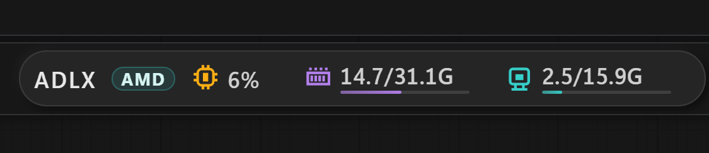
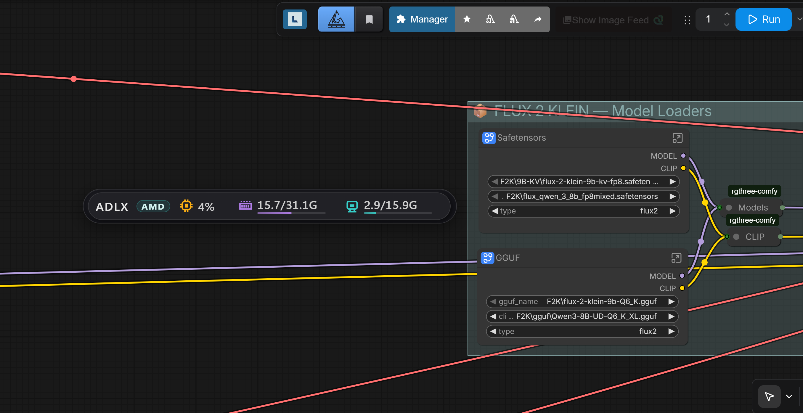
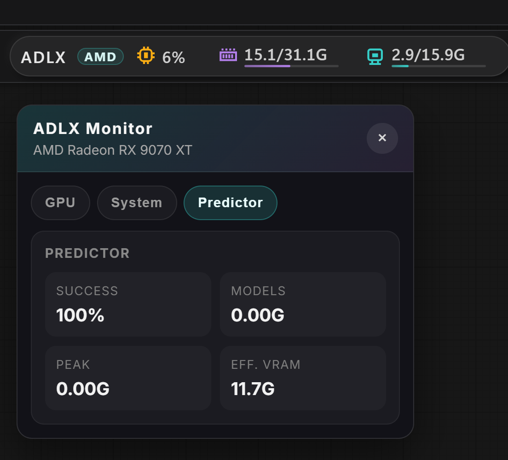
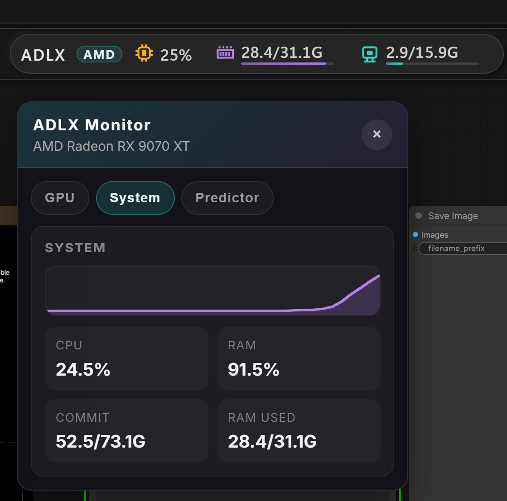
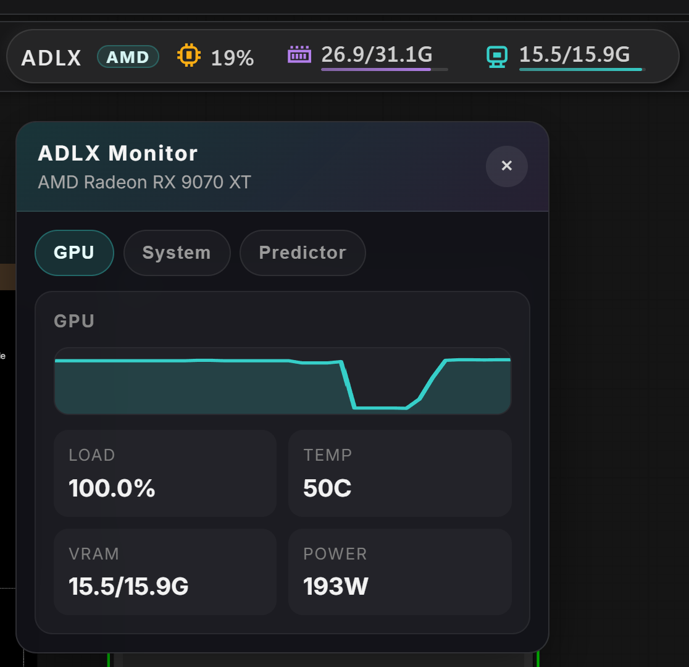

# ComfyUI-ADLX-Monitor

> **AMD-first Telemetry for ComfyUI**
>
> ComfyUI-ADLX-Monitor is an AMD-focused hardware telemetry monitor for ComfyUI, built around ADLX on Windows and kept practical for everyday monitoring.
>
> This fork refocuses the original project around AMD telemetry, Windows usability, and a compact chip + popup UI.
>
> ADLX on Windows is the primary path. ROCm remains as a secondary fallback where it makes sense, but AMD support is the explicit project priority.

---

## Overview

**ComfyUI-ADLX-Monitor** is an AMD-first ComfyUI hardware monitor that displays real-time GPU, CPU, and RAM stats in a compact top-bar chip with a floating detail panel. It includes the workflow success predictor inherited from the original project, but the main technical focus here is AMD telemetry via ADLX on Windows.

If you only need the Windows AMD telemetry implementation details, see [Windows AMD Telemetry](docs/windows_amd_telemetry.md).

---

## Fork Origin

This project is a focused fork of **ComfyUI-XPUSYS-Monitor**.

- Original project: https://github.com/allanmeng/ComfyUI-XPUSYS-Monitor
- Original license: MIT
- Fork goal: narrow the maintenance scope to AMD-centric telemetry, especially Windows + ADLX

---

## Features

- one compact **ADLX chip** in the ComfyUI top bar — always visible, shows CPU%, RAM used/total, and VRAM used/total at a glance
- one floating panel with three tabs: **GPU**, **System**, and **Predictor**

> Click the chip to open the floating panel. Hover it for a quick GPU load, clock, and temperature preview.

---

### Top Bar Chip



The chip can run in two modes, switchable via the **UI Mode** setting:

- **Top Bar (new menu)** — embeds the chip into the ComfyUI top bar (default)
- **Floating Overlay** — detaches the chip from the top bar and places it as a draggable pill anywhere on the canvas; works with both old and new ComfyUI menu systems



The top bar chip is the always-visible summary surface.

### What The Chip Numbers Mean

From left to right, the chip currently shows:

- `ADLX` — plugin label
- `AMD` — active provider badge
- chip icon + `%` — current CPU usage
- memory icon + `used / total` — current system RAM usage
- monitor icon + `used / total` — current VRAM usage

Example:

- `19%` means the host CPU is currently under roughly 19% total load
- `26.9 / 31.1G` means about 26.9 GB of system RAM is currently in use out of 31.1 GB total
- `15.5 / 15.9G` means about 15.5 GB of VRAM is currently in use out of 15.9 GB total

It shows:

- the `ADLX` plugin label
- the active provider badge, currently `AMD`
- live CPU usage
- live system RAM usage and total RAM
- live VRAM usage and total VRAM

The chip is meant to stay compact, so it does not try to expose every metric directly. Detailed telemetry lives in the popup tabs.

---

### Predictor Tab



The **Predictor** tab summarizes workflow feasibility before execution.

It currently shows four headline values:

- `Success` — predicted success rate for the active workflow
- `Models` — total detected model footprint
- `Peak` — largest single model footprint in the current workflow
- `Eff. VRAM` — effective VRAM ceiling available to the predictor

This tab is backed by the same predictor logic described in [PRED Deep Dive](#workflow-vram-predictor-pred-deep-dive).

📖 **Want a full plain-language explanation?** → [Predictor Deep Dive (EN)](docs/predictor_explained_EN.md)

---

### System Tab



The **System** tab groups the host-side metrics that matter for AMD workflow stability:

- `CPU` — overall CPU utilization
- `RAM` — physical memory usage percentage
- `Commit` — Windows committed memory versus commit limit
- `RAM Used` — used physical memory versus total RAM

This tab is the place to watch spillover pressure when a workflow exceeds clean VRAM capacity and starts leaning on RAM and commit space.

> Data source: `psutil.virtual_memory`, CPU sampling via `psutil`, and Windows commit statistics via `GlobalMemoryStatusEx`

---

### GPU Tab



The **GPU** tab groups the GPU-side telemetry in one place instead of splitting it across older per-capsule screenshots.

It currently shows:

- `Load` — live GPU utilization
- `Temp` — GPU temperature
- `VRAM` — used VRAM versus total VRAM
- `Power` — instantaneous power draw when exposed by the active AMD telemetry backend

The chart above the cards provides a short rolling view of recent GPU activity.

> Data source: ADLX or ROCm for device telemetry, plus `torch.cuda` allocator data where VRAM breakdown needs allocator context

---

### 🌐 Platform Support

- **AMD on Windows** — primary path via `ADLXPybind` / ADLX
- **AMD on ROCm** — secondary path via `rocm_smi`; optional install: `pip install rocm_smi_lib`
- **Non-AMD systems** — not a target runtime for this fork; unsupported setups surface a configuration error instead of falling back to Intel or NVIDIA providers

### Windows AMD Telemetry Flow

On the Windows-focused path in this fork, the runtime is intentionally split by responsibility:

- **ADLX** provides the AMD device identity and vendor telemetry: GPU load, core clock, temperature, driver-level VRAM totals, and power when the driver exposes it.
- **PyTorch allocator stats** come from `torch.cuda.memory_allocated()` and `torch.cuda.memory_reserved()`. AMD PyTorch still uses the CUDA-facing allocator API here, so those values are expected on the AMD path.
- **CPU / RAM / commit stats** come from `psutil` and the Windows memory APIs used by `GlobalMemoryStatusEx`.
- **Failure behavior is explicit**: if Windows AMD telemetry cannot be initialized, the fork shows a visible provider/configuration error instead of silently switching to Intel or NVIDIA logic.

---

## Workflow VRAM Predictor (PRED) Deep Dive

### What is it predicting?

Before you click Run, the plugin quietly estimates one thing:

> **"Given the current state of this machine, how likely is this workflow to complete without crashing?"**

That probability is what the `PRED` capsule shows. The most common reason AI image generation crashes is simple — **not enough VRAM**. But "not enough" isn't binary: the system can borrow from RAM and virtual memory to compensate, so success probability is a continuous value, not a yes/no.

### Core Insight: Models Don't Need to Be in VRAM Simultaneously

ComfyUI workflows run **serially** — CLIP encoding, diffusion sampling, VAE decoding each load, run, and unload one at a time.  
So the real rules for "can this run?" come down to just two constraints:

1. **Can the largest single model fit in VRAM?** (Hard constraint — determines survival)
2. **Can all models relay through RAM?** (Soft constraint — determines stability)

### How Each Constraint Affects Success Rate

**Hard Constraint — Peak Model vs Available VRAM**

```
Available VRAM = (Free VRAM + PyTorch Cache) × 0.9
```

The `0.9` discount accounts for VRAM fragmentation. The more overflow, the steeper the drop:

| Overflow | AMD-focused estimate |
|----------|----------------------|
| 0% (just fits) | 100% |
| 100% (2× VRAM) | ~5% |
| 200% (3× VRAM) | ~0% |
| 300% (4× VRAM) | ~0% |

**Platform Differences:** This fork uses a conservative AMD-oriented predictor model. It does not assume NVIDIA-style Unified Memory overflow behavior, so over-budget workflows are treated pessimistically on purpose.

**Soft Constraint — Total Model Size vs RAM / Virtual Memory**

| Scenario | Success Rate Range |
|----------|--------------------|
| All models fit in VRAM | 100% |
| Exceeds VRAM, but free RAM can relay | 70%–100% |
| RAM also insufficient, needs virtual memory (disk paging) | 5%–70% |
| Even virtual memory is exhausted | ~0% |

**Final Success Rate = Hard Constraint Rate × Soft Constraint Rate**

> Key takeaway: If the largest model can't fit in VRAM, overall success rate will be severely dragged down regardless of how much RAM you have.

### Color Signals and Recommended Actions

| PRED Display | Meaning | Recommendation |
|-------------|---------|----------------|
| 🟢 ≥ 80% | Safe | Run freely |
| 🟡 40%–80% | Warning | Close memory-heavy apps, or reduce model precision |
| 🔴 < 40% | Danger | Reduce model count in workflow, or switch to smaller models |

### Practical Tips to Reduce Memory Pressure

- Replace FP16 models with **quantized models** (GGUF Q4/Q8) — cuts VRAM usage by 50–75%
- Set unused nodes to **bypass** — the predictor automatically excludes them
- Close browsers, games, and other memory-heavy apps before running
- After an OOM crash, **restart ComfyUI** to clear VRAM fragmentation — the same workflow may succeed afterward
- If using multiple LoRAs, consider merging them into a single file in advance

> **Note**: The algorithm estimates VRAM usage from model disk file sizes. For quantized models (GGUF), actual VRAM usage is much lower than the estimate — so the true success rate will be higher than displayed. This is intentional conservative estimation; the bias direction is safe for users.

📖 **Want a full plain-language explanation?** → [Predictor Deep Dive (EN)](docs/predictor_explained_EN.md)

---

## Installation

### Manual Installation
```bash
cd ComfyUI/custom_nodes
git clone https://github.com/zvonac99/ComfyUI-ADLX-Monitor.git
```

---

## Dependencies

| Package | Purpose |
|---------|---------|
| `psutil` | CPU / memory monitoring (required) |
| `ADLXPybind` | Primary AMD telemetry backend on Windows |
| `rocm_smi_lib` | AMD GPU monitoring — only needed on AMD ROCm systems; pip install rocm_smi_lib |

> **Note**: `torch` and `aiohttp` are provided by ComfyUI itself — no separate installation needed.

---

## Permissions

On the AMD Windows path, ADLX telemetry is the primary backend and does not require the Intel-specific administrator workflow documented in the upstream project.

If a metric still shows as unavailable, treat it as a driver/backend capability issue first, not as an Intel-style elevation requirement.

---

## Settings

Adjustable in the **ADLX_Mon** section of ComfyUI's settings page:

- **Refresh Interval**: Data update frequency (200–5000 ms, default 1000 ms)
- **Font Size**: Status bar text size (12–22 px, default 16 px)
- **Provider Mode**: `Auto`, `Prefer AMD`, or `Force AMD`
- **Show Bar Values**: keep the chip compact with only the `ADLX` label and active provider badge
- **UI Mode**: `Top Bar (new menu)` or `Floating Overlay`

Notes:

- `Provider Mode` changes apply on the next ComfyUI restart.
- `Auto` selects the first supported AMD telemetry path the fork can initialize.
- `Prefer AMD` explicitly tries the AMD provider first, then continues with the same AMD-only auto detection path.
- `Force AMD` does not silently fall back. If AMD telemetry is unavailable, ADLX Monitor surfaces a visible configuration error instead.
- The compact chip now shows the active provider badge and a reduced summary of CPU, RAM, and GPU memory usage.
- `Top Bar (new menu)` embeds the chip into the ComfyUI top bar — works with ComfyUI's newer menu system.
- `Floating Overlay` detaches the chip from the top bar and places it as a draggable pill anywhere on the canvas — works with both old and new ComfyUI menu systems. Position is saved between sessions.

---

## System Requirements

- ComfyUI (any recent version)
- Python 3.10+
- Python environment compatible with ComfyUI and your AMD backend
- Windows (primary test environment); Linux theoretically compatible — feedback welcome

---

## License

[MIT License](LICENSE)

---

## Acknowledgements

Thanks to everyone who helped this project go further:

- **Upstream users and contributors** — Thanks for shaping the original project and proving the monitor was worth building out.
- **AMD users** — Thanks for the feedback that pushed this fork toward a Windows-first ADLX path and a cleaner AMD-focused scope.
- **Beta testers** — Thanks for investing your time in early versions: testing, filing issues, and suggesting improvements. The stability we have today wouldn't exist without you.
